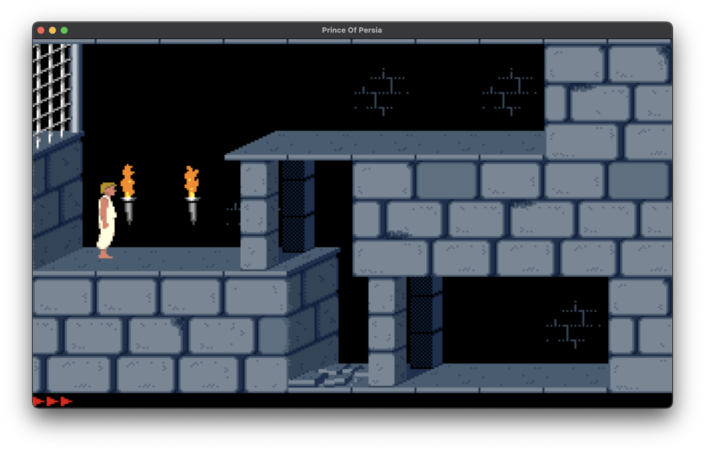
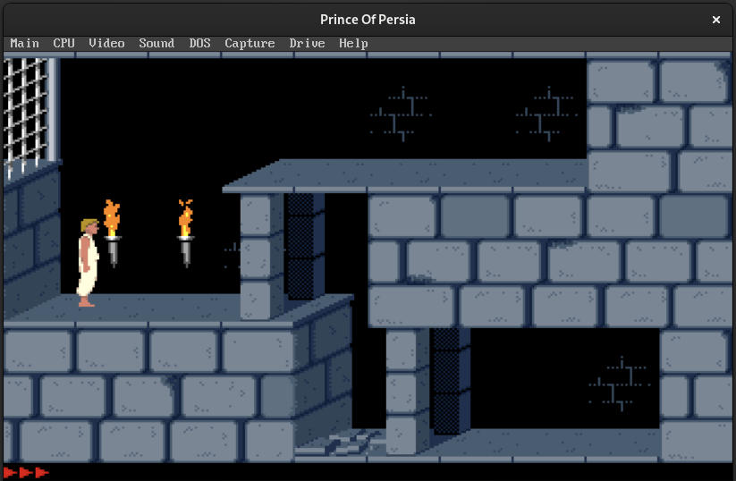

# POP1Nix

Welcome to the ultimate way to play Prince of Persia 1 on UNIX systems using Nix flakes! 

This project uses DOSBOX-X, a DOS emulator, with some cool patches to give you a smooth gaming experience.
🌟
# Supported platforms

- i686-cygwin
- x86_64-cygwin
- x86_64-darwin
- i686-darwin
- aarch64-darwin
- armv7a-darwin
- i686-freebsd13
- x86_64-freebsd13
- x86_64-solaris
- aarch64-linux
- armv5tel-linux
- armv6l-linux
- armv7a-linux
- armv7l-linux
- i686-linux
- loongarch64-linux
- m68k-linux
- microblaze-linux
- microblazeel-linux
- mips-linux
- mips64-linux
- mips64el-linux
- mipsel-linux
- powerpc64-linux
- powerpc64le-linux
- riscv32-linux
- riscv64-linux
- s390-linux
- s390x-linux
- x86_64-linux
- aarch64-netbsd
- armv6l-netbsd
- armv7a-netbsd
- armv7l-netbsd
- i686-netbsd
- m68k-netbsd
- mipsel-netbsd
- powerpc-netbsd
- riscv32-netbsd
- riscv64-netbsd
- x86_64-netbsd
- i686-openbsd
- x86_64-openbsd
- x86_64-redox

## macOS



## Linux



## How to Play

You can dive right into the action with this command:

```bash
nix run "github:matteo-pacini/pop1nix#pop1"
```

Don't Have Flakes and nix-command Enabled? No Worries!

If you haven't enabled flakes and nix-command, you can still join the fun. Just use this command:

```bash
nix --extra-experimental-features 'nix-command flakes' run "github:matteo-pacini/pop1nix#pop1"
```

## Note

This project is just for fun and to show off what Nix flakes can do with classic games on modern UNIX systems. 

All trademarks and copyrights are owned by their respective owners.